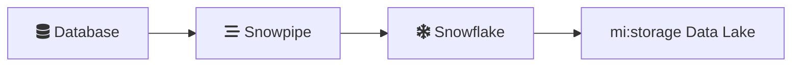

# SnowGram UI/UX Documentation

> **Complete guide to UI features, edge interactions, and design system**  
> Last updated: 2026-02-13

---

## Table of Contents

1. [Layout & Design](#layout--design)
2. [Edge Interactions](#edge-interactions)
3. [Keyboard Shortcuts](#keyboard-shortcuts)
4. [Design System](#design-system)
5. [Accessibility](#accessibility)

---

## Layout & Design

### Main Layout

| Component | Width | Purpose |
|-----------|-------|---------|
| Sidebar | 40% (min 450px) | Chat interface, saved diagrams |
| Canvas | 60% | Diagram preview, ReactFlow |

### Color Scheme

**Primary Gradient:**
```css
background: linear-gradient(135deg, #667eea 0%, #764ba2 100%)
```

**Surfaces:**
- Sidebar/Canvas: `rgba(255, 255, 255, 0.95)` with blur
- User messages: `#e3f2fd` (light blue)
- Assistant messages: `#f5f5f5` (light gray)

**Interactive Elements:**
- Primary button: `#667eea` (Snowflake blue)
- Save button: `#4caf50` (green)

### Dark Mode

| Element | Light Mode | Dark Mode |
|---------|------------|-----------|
| Background | `#ffffff` | `#1E293B` |
| Edge selected | `#0F4C75` | `#60A5FA` |
| Text | `#1a1a1a` | `#f5f5f5` |

---

## Edge Interactions

### Creating Connections

1. **Hover over a node** - see 4 connection points (handles)
2. **Click and drag** from any connection point
3. **Release** on another node to create connection

### Selecting Edges

1. **Click any edge** - highlights in darker blue
2. **Floating menu appears** with two buttons:
   - 🔄 **Flip Direction** - reverse animation flow
   - 🗑️ **Delete** - remove connection

3. **Shift+Click** for multi-select
   - Menu shows "X Connections Selected"
   - Actions apply to all selected edges

4. **Click canvas** to deselect

### Animation Direction

| Direction | Visual | Meaning |
|-----------|--------|---------|
| Forward (default) | Solid line | Data flows source → target |
| Reverse | Dashed line | Dependency relationship |

**To flip:** Select edge → Click "Flip Direction"

### Deleting Connections

Three methods:
1. **Menu:** Click edge → Click "Delete" button
2. **Multi-select:** Shift+Click edges → Click "Delete (X)"
3. **Keyboard:** Select edge(s) → Press Delete/Backspace

### Visual Feedback

| State | Appearance |
|-------|------------|
| Normal | Blue (#29B5E8), 2px, animated |
| Hover | Thicker (4px), blue glow |
| Selected | Dark blue (#0F4C75), 3px, strong glow |
| Forward | Solid animated line |
| Reverse | Dashed animated line (8,4) |

---

## Keyboard Shortcuts

| Key | Action |
|-----|--------|
| Delete / Backspace | Remove selected node or edge |
| Escape | Deselect all |
| Enter | Send message (in chat input) |
| Mouse wheel | Zoom in/out |
| Click + drag canvas | Pan view |
| Shift + Click edge | Multi-select |

---

## Design System

### Typography

| Element | Size | Weight |
|---------|------|--------|
| Title | 28px | Bold |
| Section | 20px | Semi-bold |
| Body | 15px | Normal |
| Messages | 14px | Normal |
| Metadata | 13px | Light |

**Font family:** `system-ui, -apple-system, sans-serif`

### Spacing Scale

| Name | Value |
|------|-------|
| XS | 4px |
| SM | 8px |
| MD | 12px |
| LG | 16px |
| XL | 20px |
| 2XL | 24px |

### Border Radius

| Size | Value | Usage |
|------|-------|-------|
| SM | 6px | Small elements |
| MD | 8px | Buttons, cards |
| LG | 12px | Containers, dialogs |

### Shadows

| Size | Value |
|------|-------|
| SM | `0 2px 4px rgba(0, 0, 0, 0.05)` |
| MD | `0 4px 12px rgba(102, 126, 234, 0.3)` |
| LG | `2px 0 10px rgba(0, 0, 0, 0.05)` |

### Animations

| Animation | Duration | Easing |
|-----------|----------|--------|
| Message fade-in | 0.3s | ease-in |
| Button hover | 0.3s | ease |
| Input focus | 0.3s | ease |
| Menu slide-down | 0.2s | ease |

---

## Accessibility

### Current Features

- ✅ High contrast text
- ✅ Clear focus states on inputs
- ✅ Keyboard navigation (Enter to send)
- ✅ Loading indicators with text
- ✅ Error messages with context

### Browser Support

| Browser | Status |
|---------|--------|
| Chrome 120+ | ✅ Primary |
| Firefox 121+ | ✅ Tested |
| Safari 17+ | ✅ Tested |
| Edge 120+ | ✅ Tested |

---

## Component Reference

### Chat Interface

| Element | Styling |
|---------|---------|
| Input padding | 14px × 16px |
| Input text | 15px |
| Input border-radius | 12px |
| Send button padding | 14px × 24px |
| Send button weight | Bold (600) |

### Canvas

| Element | Value |
|---------|-------|
| Node border-radius | 8px |
| Connection point size | 8px |
| Minimap position | Bottom-right |
| Instructions panel | Bottom-left |

### Edge Contextual Menu

| Property | Value |
|----------|-------|
| Position | Top-center of canvas |
| Background | White (light) / #1E293B (dark) |
| Border | #29B5E8 |
| Animation | slideDown 0.2s |
| Shadow | 0 4px 16px rgba(0,0,0,0.12) |

---

## Icon Integration

### Available Libraries

| Library | Endpoint | Icons |
|---------|----------|-------|
| Font Awesome | `/api/icons/catalog/font-awesome` | 38+ |
| Material Icons | `/api/icons/catalog/material-icons` | 20+ |
| Mermaid Shapes | `/api/icons/catalog/mermaid-shapes` | 11 |

### Icon Usage in Mermaid



### API Endpoints

| Endpoint | Purpose |
|----------|---------|
| `/api/icons/search?query={term}` | Search icons |
| `/api/icons/categories` | List categories |
| `/api/icons/examples` | Sample diagrams |

---

## Performance

| Metric | Target |
|--------|--------|
| Initial page load | <2 seconds |
| Diagram generation | 5-10 seconds |
| Save/load operations | <1 second |
| Icon catalog fetch | <500ms |
| Edge selection | Instant |
| Animation | 60fps |

---

## User Workflows

### Creating a Diagram

1. Type description in chat
2. Wait for agent response (~5-10s)
3. View rendered diagram
4. Save with custom name

### Editing Connections

1. Click edge to select
2. Use contextual menu to flip/delete
3. Or use keyboard shortcuts
4. Click canvas to deselect

### Managing Diagrams

1. Save: Click save button, enter name
2. Load: Click diagram in saved list
3. Delete: Click delete icon on saved item

---

## Tips & Best Practices

### For Users

1. **Zoom in** for dense diagrams
2. **Use minimap** for navigation
3. **Solid = forward, Dashed = reverse** for edge direction
4. **Delete key** is faster than menu button
5. **Click canvas** to deselect quickly

### For Developers

1. Edge state managed via `selectedEdge` hook
2. Multi-select tracked in Set
3. Animations use CSS transitions
4. Dark mode via CSS variables
5. ReactFlow handles canvas rendering

---

*Last updated: 2026-02-13*
